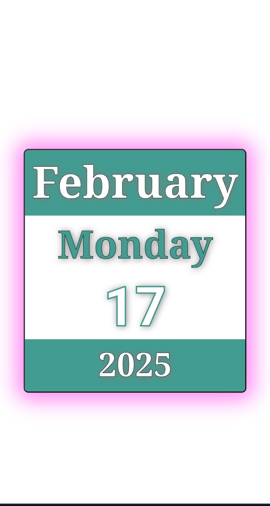

# Mini Calendar

## Description
This is a simple Mini Calendar project built using **HTML, CSS, and JavaScript**. It dynamically displays the current date, day, month, and year in a visually appealing format.

## Features
- Displays the current **month, day, date, and year**.
- Uses **JavaScript** to fetch and update the date dynamically.
- Styled using **CSS** for an elegant design.
- Fully responsive and easy to use.

## Technologies Used
- **HTML**: Structure of the calendar.
- **CSS**: Styling for the calendar.
- **JavaScript**: Fetches the current date and updates the UI dynamically.

## How to Use
1. Clone the repository:
   ```sh
   git clone https://github.com/ajit2005-tec/mini_calendar.git
   ```
2. Open the `index.html` file in your browser.
3. The current date will be displayed automatically.

## Project Structure
```
mini-calendar/
│── index.html      # Main HTML file
│── style.css       # Stylesheet
│── main.js         # JavaScript file
│── README.md       # Project documentation
```

## Screenshot


## Live Demo
You can access the live version of this project [here](https://github.com/ajit2005-tec/mini_calendar).

## Contributing
Feel free to fork this repository and contribute by submitting a pull request.

## License
This project is licensed under the **MIT License**.

---
Made with ❤️ by [Ajit Kumar Patra]

